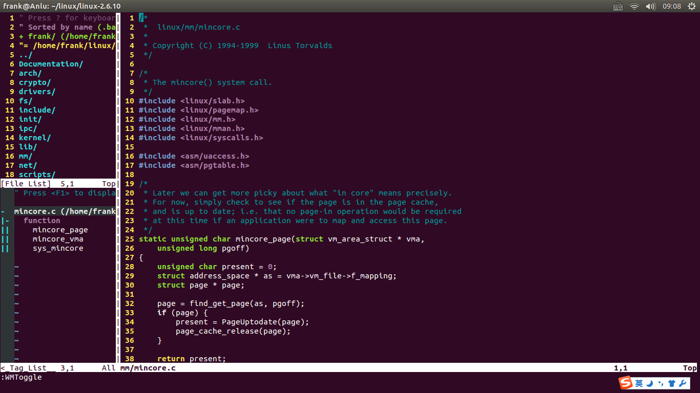
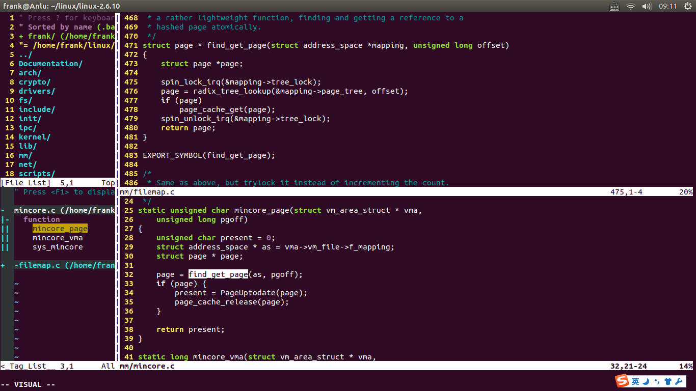

# vim-config
使用winmanager+taglist+ctags，将vim配置成IDE模式～

## 1. winmanager插件
用来管理文件浏览插件netrw(vim内置插件)和标签列表插件taglist(非内置)

## 2. taglist插件
用来展示ctags生产的标签

## 3. ctags
用来生成代码中的标签，供阅读代码跳转使用：
```
ctags -R path/to/code
```

## 4. 配置方法
只提供Ubuntu的配置方法：下载本仓库后解压，执行deploy.sh脚本（没有可执行权限，则需要添加：chmod +x deploy.sh），也可以将以下脚本单步执行：
```
sudo apt-get install vim ctags

mkdir -p ~/.vim/plugin ~/.vim/doc

unzip taglist_46.zip -d ~/.vim
unzip winmanager.zip -d ~/.vim

sudo cp vimrc.local  /etc/vim/vimrc.local
```

## 5. winmanager使用方法
vim打开一个目录后，在normal模式时直接按顺序敲键盘上w键和m键就会开启文件和标签浏览器，再次敲wm键就会关闭。

## 6. 效果图

